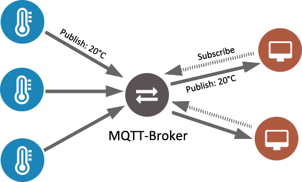

# Mosquitto MQTT broker

Each message is published to a specific topic. The topic is the message routing information, and it is simply a string that can have slash separated hierarchy levels. Clients subscribe to these topics, and the broker delivers all messages sent with matching topics to them. It is also possible to use wildcards to easily subscribe to multiple topics. With this communication scheme, the data producers and consumers do not need to know about each other. They only communicate using a common topic.
Here the MQTT broker is local and run on a Raspberry PI.

