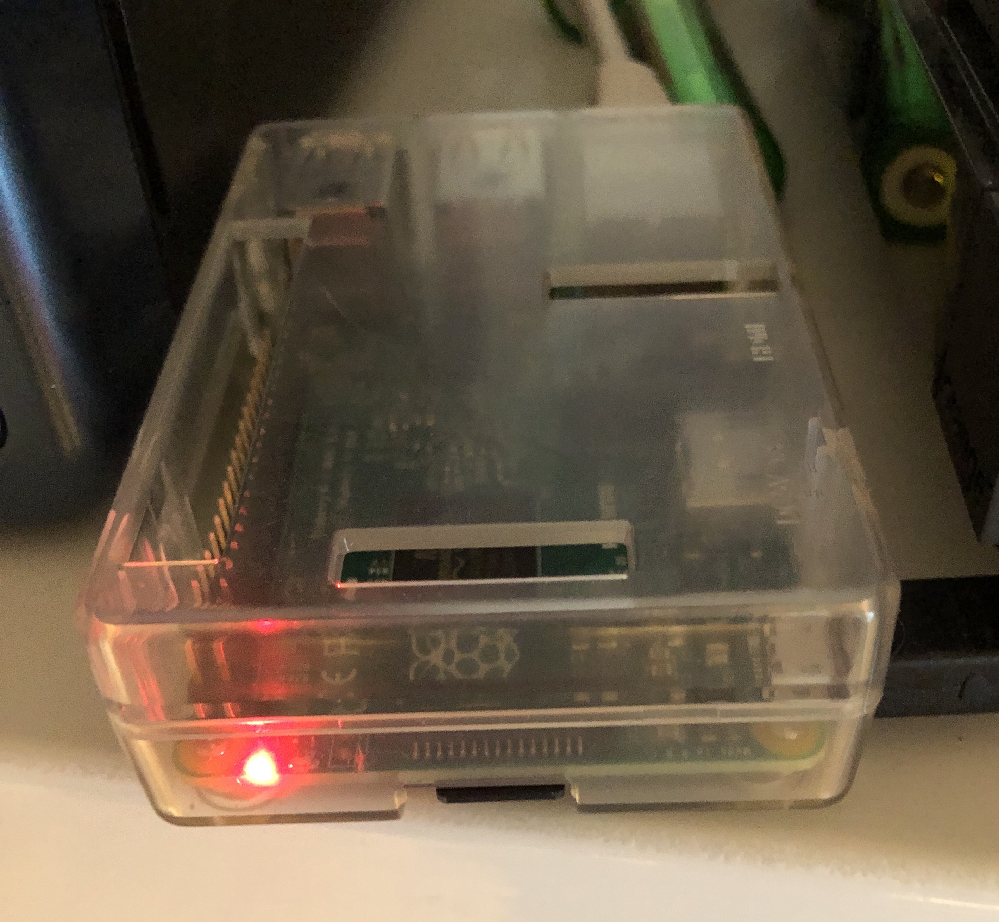
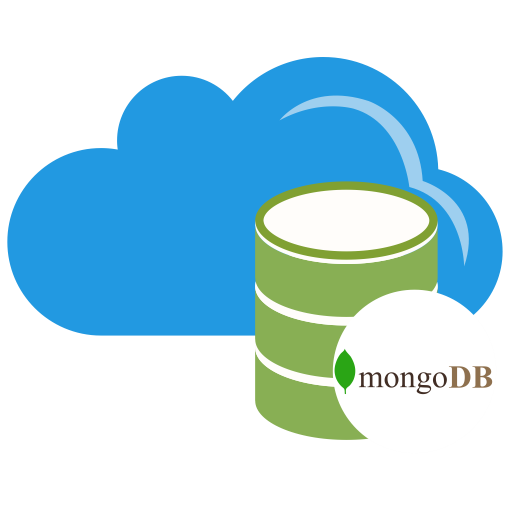

# IoT

Home automation and DIY experiment using Raspberry, Arduino and Microcontroller.
The lab proposed here is to push (any) sensor data from the microchop to the Cloud. The public Cloud selected by MongoCloud will be Azure (EU instance for more proximity with my home) but you can instance the same IOT db in AWS or GCP.

        

This end to end example/sample looks like a 3 tier architecture:

  1- Microcontroller ESP8266 is having a temperature sensor (BMP280) using I2C bus. This microchip is connected in Wifi to the LAN and is executing a C program: Getting temperature, call NTP to get an appropriate date/time, formatting a simple JSON data struct and broadcast it to MQTT broker.

  2- MQTT broker is a Raspberry running a python broker. Connected to the LAN, It reads some JSON data from microcontroller/Temp sensor and reformat another JSON data structure which can be consumed by MongoDB. This broker is a MQTT listener and receive publications, here the RPI is acting as a gateway prior pushing data to IoT database using MongoDB. Potentially many sensors can broadcast data to this gateway before it gets stored in the Cloud.

  3- MongoDB Cloud running over Azure (remote EU instance!) is receiving documents via webhook Stitch: sensor name, value and date/time. Charts or any other graphical representation can be used grabbing data from MongoDB.

It becomes easy to extend with more sensors, more charts. Each sensor should target the MQTT broker publishing messages with its own topic.
