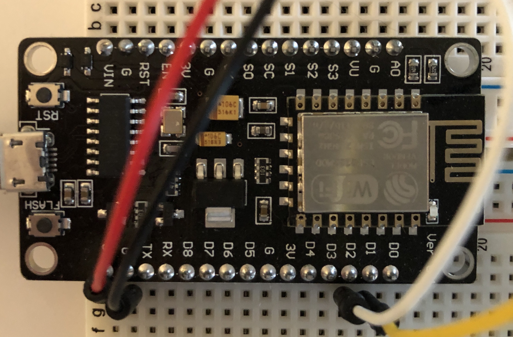

# NodeMCU ESP8266 Microcontroller

Extract from: https://en.wikipedia.org/wiki/NodeMCU
 
Buying ESP8266 (7 euros): https://www.amazon.fr/dp/B06Y1ZPNMS/ref=cm_sw_em_r_mt_dp_U_5wq2EbJ6V774R
Buying BMP280 (<5 euros): https://www.amazon.fr/dp/B07FS3QQFH/ref=cm_sw_em_r_mt_dp_U_4nv2EbNFD6PDF

Many kind of sensors having i2c bus can be connected to this microchip. Here I am using C language with Arduino IDE. It is also possible to patch the firmware with Micropython. I tested to patch the firmware with BIN file downloaded from here https://micropython.org/download/esp8266/ but I felt more comfortable with C program/Arduino IDE.

Schematics : VCC/GND and for i2c: D1-SCL and D2-SDA

 
Interesting links: 
 - https://microcontrollerslab.com/led-blinking-using-esp8266-nodemcu/
 - https://myesp8266.blogspot.com/2016/12/bmp280-and-esp8266.html
 - https://blog.bandinelli.net/index.php?post/2016/10/23/Micropython-sur-ESP8266%2C-l-%C3%A9lectronique-toujours-plus-libre-et-puissante-%21
 - https://docs.micropython.org/en/latest/index.html
 - https://docs.micropython.org/en/latest/esp8266/tutorial/repl.html#using-the-repl
 - http://micropython.org/webrepl
 - https://randomnerdtutorials.com/micropython-bme280-esp32-esp8266/
